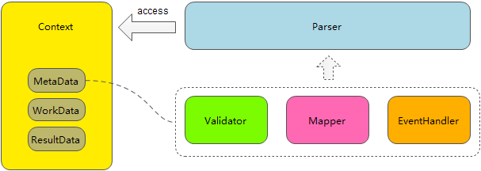

## Excel Tools
- Parse and write Excel, configuration with Pojo and Annotation.
- Design with Context. The instance can be singleton.

### Excel Parser
- Supports javax.validation
- Supports event and pagination
- Customized RowMapper
- Customized RowValidator
- Supports setup beginRow, maxRow, sheetIdx
- Supports international

#### Base Structure


Example:
```java
public class TestExcelParser {
    @Test
    public void testParse() throws Throwable {
        PoiExcelParser parser = new PoiExcelParser();
        // PoiExcelParser parser = new PoiSaxExcelParser(); // use this Parser while rows over 50,000
        InputStream in = null;
        try {
            in = TestExcelParser.class.getResourceAsStream("/demo.xlsx");
            ParseContext parseContext = parser.builder()
                    .inputStream(in)
                    .beanClass(TestBean1.class)
                    .continueOnError(true)
                    .beginRow(2)
                    .maxRow(5000)
//                    .pageSize(10)
//                    .eventHandler(new ParseEventAdapter() {
//                        @Override
//                        public void onPageChange(ParseContext context) {
//                            System.out.print("page-" + ((PoiExcelParser.PoiExcelParserWorkData) context.getWorkData()).getCurrentPage() + ": ");
//                            List list = context.getResultData().getDataList();
//                            System.out.println(list);
//                            list.clear();
//                        }
//
//                        @Override
//                        public void onFinish(ParseContext context) {
//                            List list = context.getResultData().getDataList();
//                            System.out.println("finish: " + list);
//                            list.clear();
//                        }
//                    })
                    .getParseContext();
            parser.parse(parseContext);
            System.out.println(parseContext.getResultData().getDataList());
            System.out.println(parseContext.getResultData().getErrorList());
        } finally {
            IOUtils.closeQuietly(in);
        }
    }

    @Getter
    @Setter
    public static class TestBean1 {
        @ExcelColumn.SeqField
        private long seq;

        @ExcelColumn.SeqField(begin = 0)
        private int seq2;

        @NotNull
        @Pattern(regexp = "^[\\d]{1,32}$")
        @ExcelColumn(seq = 1, name = "c1")
        private String col1;

        @NotNull(message = "col2 can not be null")
        @Pattern(regexp = "^[\\d]{1,32}$", message = "col2 format error")
        @ExcelColumn(seq = 2, name = "c2")
        private String col2;

        @NotNull
        @Pattern(regexp = "^[\\d]{1,32}$")
        @SpEL("@bean1.check(#root)")
        @ExcelColumn(seq = 3, name = "c3")
        private String col3;
    }
}
```

### Excel写入
- Supports Pojo and Map
- Supports Header configuration

Example:
```java
public class TestExcelWriter {
    @Test
    public void testWrite() throws Exception {
        List<TestBean2> list = new ArrayList<TestBean2>();
        for (int i = 0; i < 100; i++) {
            TestBean2 bean = new TestBean2();
            bean.setCol1(i + "");
            bean.setCol2(UUID.randomUUID().toString());
            bean.setCol3("sdf");
            list.add(bean);
        }

        List<Map> list2 = new ArrayList<Map>();
        for (int i = 0; i < 100; i++) {
            Map map = new HashMap();
            map.put("col1", i + "");
            map.put("col2", UUID.randomUUID().toString());
            map.put("col3", "map1234");
            list2.add(map);
        }

        PoiExcelWriter writer = new PoiExcelWriter();
        OutputStream out = new FileOutputStream(new File("/temp/1.xlsx"));
        try {
            WriteContext context = writer.builder()
                    .beanClass(TestBean2.class)
                    .outputStream(out)
                    .dataList(list2)
                    .getWriteContext();
            writer.write(context);
        } finally {
            IOUtils.closeQuietly(out);
        }
    }

    @Getter
    @Setter
    public static class TestBean2 {

        @ExcelExportColumn(seq = 1, name = "c1", width = 10)
        private String col1;

        @ExcelExportColumn(seq = 2, name = "c2", width = 50)
        private String col2;

        @ExcelExportColumn(seq = 3, name = "c3")
        private String col3;
    }
}
```